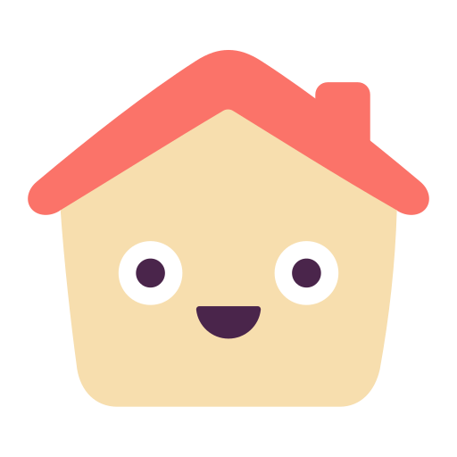

<p align="center">
  
</p>

<h1 align="center">Homebox AI</h1>

<p align="center">
  An AI-native home inventory PWA — natural-language search, photo-to-item entry, receipt import, and a maintenance/warranty assistant, built on Next.js + Supabase (Postgres/Auth/Storage) + LangGraph.
</p>

<p align="center">
  <a href="https://nextjs.org"></a>
  <a href="https://www.typescriptlang.org"></a>
  <a href="https://react.dev"></a>
  <a href="https://supabase.com"></a>
  <a href="https://www.postgresql.org"></a>
  <a href="https://orm.drizzle.team"></a>
  <a href="https://www.langchain.com/langgraph"></a>
  <a href="https://www.framer.com/motion/"></a>
  <a href="https://turbo.build/repo"></a>
  <a href="https://pnpm.io"></a>
  <a href="https://web.dev/explore/progressive-web-apps"></a>
  <a href="https://vercel.com"></a>
  <a href="https://langfuse.com"></a>
</p>

## Contents

- [Features](#features)
- [Stack](#stack)
- [Prerequisites](#prerequisites)
- [First-time setup](#first-time-setup)
- [Running the app](#running-the-app)
- [Deploying](#deploying)
- [Project layout](#project-layout)
- [Tracing (Langfuse)](#tracing-langfuse)

## Features

| Feature | Status |
| --- | --- |
| Auth (Supabase email/password) + protected app shell | ✅ Done |
| Items / Locations / Labels CRUD | ✅ Done |
| Natural-language search & chat over your inventory | 🚧 Planned |
| Photo → structured item entry | 🚧 Planned |
| Receipt import → batch item entry | 🚧 Planned |
| Maintenance & warranty assistant | 🚧 Planned |
| Installable PWA (offline app shell) | ✅ Done |

The three AI features share one LangGraph-based router (`packages/ai`) that fans each task out across free-tier providers with fallback — see [Stack](#stack).

## Stack

- **Monorepo**: pnpm workspaces + Turborepo
- **App**: Next.js (App Router), deployed to Vercel
- **Data**: Supabase Postgres, schema/queries via Drizzle ORM (`packages/db`), access controlled by Postgres Row Level Security — not just app-layer checks
- **Auth**: Supabase Auth (email/password)
- **Files**: Supabase Storage (`attachments` bucket)
- **AI**: LangGraph.js orchestration (`packages/ai`) routing across four free-tier providers (Gemini, Groq, Cerebras, OpenRouter) with task-based fallback chains
- **Tracing**: [Langfuse](https://langfuse.com) via OpenTelemetry — every AI graph invocation is traced (model, tokens, tool calls, full conversation) with per-user/per-session/per-feature attribution

## Prerequisites

- Node >= 20, pnpm (`corepack enable`)
- Docker (for `supabase start`'s local emulation stack)
- [Supabase CLI](https://supabase.com/docs/guides/cli)
- API keys for whichever of Gemini / Groq / Cerebras / OpenRouter you want working locally (the AI features degrade gracefully if some are missing, per the router's fallback chains — but at least one per task type is needed for that feature to work at all)
- A free [Langfuse](https://cloud.langfuse.com) project (for tracing — optional locally, but without it you're flying blind on what the AI graphs are actually doing)

## First-time setup

```bash
pnpm install

# Local Supabase stack (Postgres, Auth, Storage, Studio) via Docker
supabase start
# Copy the printed API URL / anon key / service_role key / DB URL into .env.local (copy .env.example first)

cp .env.example .env.local

# Apply the Drizzle schema, then the RLS policies (Drizzle Kit doesn't manage
# Supabase-specific policies — see packages/db/src/policies/README.md)
pnpm db:generate
pnpm db:migrate
for f in packages/db/src/policies/*.sql; do psql "$DATABASE_URL" -f "$f"; done
```

Then, in the Supabase Studio (URL printed by `supabase start`, or your cloud project's dashboard), create an `attachments` Storage bucket before applying `storage_attachments.sql` — that policy references the bucket by name and will fail if it doesn't exist yet.

## Running the app

```bash
pnpm dev
```

## Deploying

- **Supabase**: create a project at supabase.com, run the same migration + policy steps above against its connection string, create the `attachments` bucket.
- **Vercel**: connect this repo, set the env vars from `.env.example` (using the cloud project's values, not the local ones), deploy `apps/web`.

## Project layout

```
apps/web             Next.js app (UI + API routes)
  instrumentation.ts / instrumentation-node.ts  OpenTelemetry + Langfuse span processor setup
packages/db           Drizzle schema, migrations, RLS policies, query functions
packages/supabase     Server/browser Supabase clients, session middleware, storage helpers
packages/ai           LangGraph orchestration: provider factories, task router, one graph per AI feature
  tracing.ts          Langfuse callback handler factory — pass to a graph's invoke() config
packages/ui           Shared components (Framer Motion primitives)
packages/config       Shared tsconfig
supabase/             Supabase CLI project config (local dev emulation)
```

## Tracing (Langfuse)

Every AI graph invocation should be traced. The pattern (see `apps/web/app/api/chat/route.ts` for a full example):

```ts
import { createLangfuseHandler } from "@homebox-ai/ai";
import { after } from "next/server";
import { langfuseSpanProcessor } from "../../../instrumentation-node";

const langfuseHandler = createLangfuseHandler({ userId, sessionId, tags: ["chat"] });
const result = await graph.invoke(input, { callbacks: [langfuseHandler], runName: "chat-search" });

// Serverless functions can be frozen right after the response — schedule the
// flush so buffered spans actually get sent before that happens.
after(async () => {
  await langfuseSpanProcessor.forceFlush();
});
```

`runName` matters — without it, traces show up unnamed in the Langfuse UI (the trace-level `name`/`input`/`output` fields are deprecated in Langfuse v4+; what you actually see and search on is the **root observation's** name/input/output, which the `CallbackHandler` sets automatically from the graph's input/output as long as `runName` is set).
